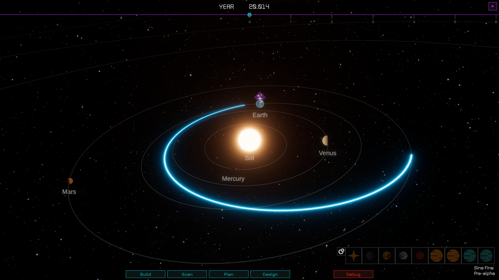

# Universe


`Universe` is a library used in the development of [Sine Fine](https://www.vindemiatrixcollective.com), a space exploration game. It provides methods and code to perform calculations useful in this genre of games. With code ported to C# from popular libraries like [poliastro](https://github.com/poliastro/poliastro), it can calculate the position of the planets given a certain date, or an interplanetary manoeuvre to travel to another planet!

## Table of Contents

* [Features](#Features)
* [Installation](#Installation)
* [Creating a galaxy](#Creating-a-galaxy)
* [Propagating orbits](#Propagating-orbits)
* [Interplanetary transfer](#Interplanetary-transfers)
* [Relativistic rockets](#Relativistic-rockets)
* [Support](#Support)

## Features
These are the features currently available in `Universe`:

* A game agnostic "galactic" object model: for each celestial body, it only contains physical and orbital data, based on the [UnitsNet](https://github.com/angularsen/UnitsNet) library to avoid (minimise) confusion and mistakes.
* Uses `double` for internal calculations and can output in `float` for Unity.
* The model supports Galaxies / (n-ary) Star Systems / Stars / Planets (and moons). Each orbiter is a `CelestialBody`.
* A Kepler simulation model that calculates the position of any object in the solar system given their orbital data and time from the [J2000 epoch](https://en.wikipedia.org/wiki/Epoch_(astronomy)#Julian_years_and_J2000).
* Kinematic propagator for orbits of binary stars.
* An interplanetary mission planner that calculates possible transfers given a set of launch windows.
* A set of functions to calculate mission profiles for *relativistic rockets*, to obtain the acceleration and cruise time for both the observer and the ship, and the total duration of the mission given speeds that approach fractions of c.
* (optional) custom deserialisation converters in the assembly `com.vindemiatrixcollective.universe.data`.
* Unit tests based on results from [poliastro](https://github.com/poliastro/poliastro) and other sources.

## Installation

1. Open the Unity Package Manager from Window > Package Manager
2. Click on the "+" button > Install package from git URL
3. Enter the following URL:

```
https://github.com/TheWand3rer/Universe.git?path=/Universe
```

## Creating a galaxy
The easiest way is to use the `com.vindemiatrixcollective.universe.data` package and deserialise the Solar system data. To do so, move the file [SolarSystem.json](Documentation/Data/Systems.json) into your `Resources/Data` folder. Then, you can deserialise its contents by implementing a function like the following (you can also use the provided [DeserializationHelper](Universe/Tests/DeserializationHelper.cs)):

```cs
public T DeserializeFile<T>(string filename, params JsonConverter[] converters)
{
    TextAsset text = Resources.Load<TextAsset>(filename);
    T data = JsonConvert.DeserializeObject<T>(text.ToString(), converters);
    return data;
}

public Galaxy LoadSol(ref Galaxy galaxy, string path = "Data/SolarSystem.json")
{
    JsonSerializerSettings settings = new();
    Galaxy additionalData = DeserializeFile<Galaxy>(path,
        new CoreObjectConverter<Galaxy>(new GalaxyConverter()),
        new CoreObjectConverter<StarSystem>(new StarSystemConverter()),
        new CoreObjectConverter<Star>(new StarConverter()),
        new CoreObjectConverter<Planet>(new PlanetConverter()));
    foreach ((string key, StarSystem system) in additionalData.Systems)
    {
        galaxy[key] = system;
    }
}
```
then call it via:
```cs
Galaxy galaxy = new Galaxy("Milky Way");
LoadSol(ref galaxy);
```

### From code
```cs
Galaxy     galaxy = new Galaxy("Milky Way");
StarSystem sol    = new StarSystem("Sol");

// Star.Sol and Planet.Earth are included as examples with hardcoded values at J2000.
// You should create stars and planets with the appropriate constructors or factory methods
Star   sun   = Star.Sun;
Planet earth = Planet.Earth;

galaxy.AddSystem(sol);
sun.AddPlanet(earth);
sol.AddStar(sun);
```

## Propagating orbits
Define a solar system, then in your `Start` or other initialisation method:
### Keplerian Orbits
```cs
// iterate on every body in the Solar system or use the provided Hiearrchy enumerator,
// or use CelestialBody.PreOrderVisit | LevelOrderVisit
planet.OrbitState.Propagate(DateTime.Today);
```
Then, in your `Update` method:
```cs
float delta = speed * 86400 * Time.deltaTime;
planet.OrbitState.Propagate(delta);

// When you need to use the calculated position, in the gameobject representing your Planet:
transform.position = planet.OrbitState.Position.FromMetrestoAU(unitsPerAU).ToXZY();
```
Remarks:
* Set speed as a multiplier to define how many in-game seconds correspond to a day: 1 day = 86400 seconds.
* Set unitsPerAU to define how many Unity units correspond to one Astronomical Unit (AU).
* `.toXZY()` is necessary because the calculations are computed using Y as up, to adapt to the original libraries.

### Binary Orbits
https://github.com/user-attachments/assets/de2b0dad-f1b2-437a-9703-2bb9262cb911

The Keplerian propagator works best for two-body problems where one is massive (like a star) and the other is much smaller (a planet). For star systems that have two or more stars, the Keplerian propagator cannot be used for the orbits of the stars. There is a `Kinematic` propagator that you can assign to the `OrbitState` of both stars, which will make them orbit without being affected by each other. An n-body simulator will be added in the future.

```cs
Star primary = stars[0];
Star companion = stars[1];

OrbitalData o = companion.OrbitalData;
Barycentre barycentre = new(primary.StarSystem);
(Length a1, Length a2) = barycentre.CalculateSemiMajorAxes(primary, companion, o.SemiMajorAxis);

primary.Attractor   = barycentre;
companion.Attractor = barycentre;

// Only a, e, i, Ω (longitude of ascending node), ω (argument of periastron, and P are necessary
// i here is zero to make sure that your view is aligned to the orbital plane,
// but in catalogues this value represents the inclination as seen from Earth
OrbitalData o1 = new(a1, o.Eccentricity, Angle.Zero, o.LongitudeAscendingNode, o.ArgumentPeriapsis, o.Period,
                     Duration.Zero, Angle.Zero,
                     trueAnomaly: Angle.FromDegrees(0));
// ω is shifted 180° to place the other state at the opposite side
// however you could calculate the "current position" from the time of periastron T0 if you have it
OrbitalData o2 = new(a2, o.Eccentricity, Angle.Zero,
                     o.LongitudeAscendingNode, //Angle.FromDegrees((o.LongitudeAscendingNode.Value + 180) % 360),
                     Angle.FromDegrees((o.ArgumentPeriapsis.Value + 180) % 360), o.Period,
                     Duration.Zero, Angle.Zero,
                     trueAnomaly: Angle.FromDegrees(0));

primary.OrbitalData   = o1;
companion.OrbitalData = o2;

IPropagator propagator = new Kinematic();
primary.OrbitState.SetPropagator(propagator);
companion.OrbitState.SetPropagator(propagator);
```


## Interplanetary Transfers
[SineFine_transfer.webm](https://github.com/user-attachments/assets/df0ded8a-72e8-4578-8fe2-4075dfc0b5b2)

### Simple transfer
You can calculate a transfer between two known planets at any moment in time (based on J2000). 
The full implementation is in [LambertTests](Universe/Tests/LambertTests.cs).

```cs
CelestialBody earth = Common.Earth;
CelestialBody mars  = Common.Mars;

DateTime epochDeparture = new DateTime(2018, 12, 1, 0, 0, 0, DateTimeKind.Utc);
DateTime epochArrival   = epochDeparture.AddYears(2);

earth.OrbitState.SetAttractor(Common.Sun);
mars.OrbitState.SetAttractor(Common.Sun);
earth.OrbitState.Propagate(epochDeparture);
mars.OrbitState.Propagate(epochArrival);

IzzoLambertSolver solver = new IzzoLambertSolver();
Manoeuvre m = Manoeuvre.Lambert(earth.OrbitState, mars.OrbitState, solver);
```

If you print `m`, among other data it will output the manoeuvre's total DeltaV cost and transfer duration:
```
Total duration: 731 d
Total cost: 56.031 km/s
```
### Mission Planner
You can also request a full analysis of the potential transfer windows given a certain launch and arrival time span. This is the so-called ["porkchop"](https://docs.poliastro.space/en/stable/examples/Porkchops%20with%20poliastro.html) chart. You can replicate that poliastro example with `Universe` (except for the plotting). Full details in the `PorkchopTest` 
in [TransferPlannerTest](Universe/Tests/TransferPlannerTest.cs).

```cs
Planet earth = Common.Earth;
Planet mars  = Common.Mars;

earth.OrbitState.SetAttractor(Common.Sun);
mars.OrbitState.SetAttractor(Common.Sun);

TransferPlanner tp        = new CelestialMechanics.Manoeuvres.TransferPlanner(earth, mars);
DateTime        startDate = new DateTime(2025, 1, 1, 0, 0, 0, DateTimeKind.Utc);
tp.CalculateTransferWindows(startDate, 200, 50);
TransferData transfer = tp.OrderByDeltaV().First();
// you can also order the transfers in order of transfer duration
// via tp.OrderByTransferTime()
```

You can then use the `TransferData` [struct](Universe/CelestialMechanics/Manoeuvres/TransferData) to access various properties. If you call `transfer.TransferOrbit(1)` you will obtain a new `OrbitState` object with the first impulse applied, which is the transfer orbit. If you call `transfer.TransferOrbit(0)` or `transfer.TransferOrbit(2)` it will return the circularised orbit around the destination Planet.

## Relativistic rockets
These methods calculate interstellar missions based on relativistic rockets: how long would a trip to another star system take at speeds approaching `c`, the speed of light? Run the [RelativisticRocketTests](Universe/Tests/RelativisticRocketTests.cs).

```cs
// Values from Project Longshot to Alpha Centauri Orbit
Length       distanceAlphaCentauri = Length.FromLightYears(4.344);
Speed        maxSpeed              = Relativity.SpeedFromFractionOfC(0.048f); // page 20, 59
Acceleration acceleration          = Acceleration.FromMetersPerSecondSquared(0.429); // page 68

RelativisticTravelData result = Relativity.CalculateTravel(distanceAlphaCentauri, maxSpeed, acceleration);
```
Example output:
```
Distance: 4.34 ly
Maximum speed reached: 0.05 c
Acceleration: 0.04 g
Total travel time (obs/ship): 91.63 y / 91.52 y
Acceleration/deceleration phase (obs/ship): 1.06 y / 1.06 y
Cruise phase (obs/ship): 89.50 y / 89.39 y
Distance acceleration - cruise - deceleration: 0.03 ly + 4.29 ly + 0.03 ly
Total distance: 4.34 ly
Rapidity: 0.05
```

## Support
If you have questions, please create an [issue](https://github.com/TheWand3rer/SineFine/issues) here or join the [Discord](https://discord.gg/qCX6XKvJ4f).

## See also:
* [Sine Fine](https://vindemiatrixcollective.com): a space exploration game played at sublight speeds.
* [astrolabium](https://github.com/TheWand3rer/astrolabium): a python project to combine data from stellar catalogues into the data structures used in the Universe library to represent the galaxy and its star systems.
